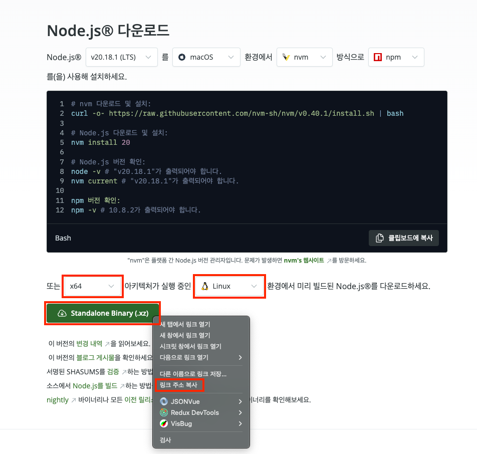
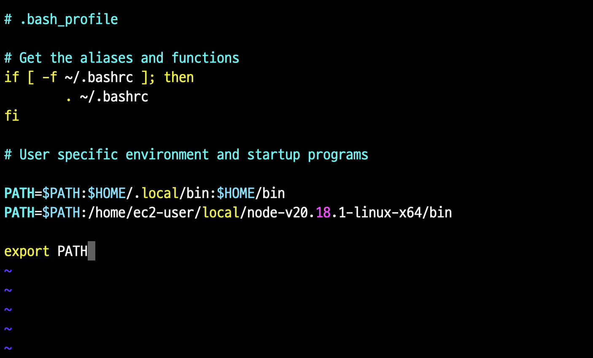

## Git, Node.js 설치

### 1. 시스템 업데이트 및 Git, htop 설치

서버에 접속한 후, 시스템을 업데이트하고 `git`과 `htop`을 설치:

```bash
sudo yum update -y
sudo yum install git htop -y
```

> 💡 htop 이란?
> <br />
> 메모리와 CPU 상태를 볼 수 있는 top 명령을 개선한 프로그램

<br />

### 2. Node.js 설치

1. [Node.js 다운로드 페이지](https://nodejs.org/ko/download)에 접속
1. 원하는 버전을 선택하고, `x64` 아키텍처의 `Linux` 환경으로 설정한 후 다운로드 버튼의 링크를 복사
   <br /><br />
   
1. 서버에서 다음 명령어를 실행해 Node.js를 다운로드하고 압축을 해제

   ```bash
   mkdir ~/local
   cd ~/local
   wget https://nodejs.org/dist/v20.18.1/node-v20.18.1-linux-x64.tar.xz
   tar xvf node-v20.18.1-linux-x64.tar.xz
   ```

1. Node.js 바이너리가 있는 디렉토리로 이동한 후 경로를 확인

   ```bash
   cd node-v20.18.1-linux-x64/bin/
   pwd # /home/ec2-user/local/node-v20.18.1-linux-x64/bin
   ```

1. 경로를 복사한 후, **.bash_profile**에 추가

   ```bash
   vi ~/.bash_profile
   ```

   

1. **.bash_profile** 업데이트 후 적용

   ```bash
   source ~/.bash_profile
   ```

1. Node.js 설치 확인

   ```bash
   node -v # v20.18.1
   ```
