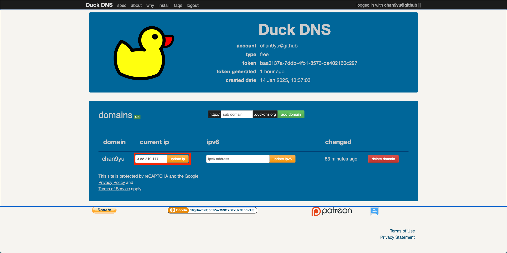
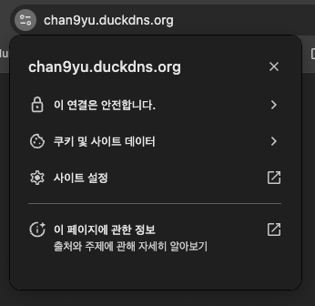

## HTTPS 설정

도메인이 설정이 되면 HTTPS 설정이 가능하다.

<br />

### 도메인 설정

무료 DNS 서비스를 제공하는 Duck DNS를 활용하여 도메인을 설정할 수 있다.

1. [Duck DNS](https://www.duckdns.org/domains) 접속
2. Twitter, Github, Google 중 편한 로그인 방식을 선택하여 로그인
3. 원하는 도메인 주소와 매핑할 `웹 서버 IP 주소(퍼블릭 IPv4 주소)`를 입력하여 등록

   - 도메인 주소는 중복되지 않도록 유니크하게 설정

4. 등록한 도메인 주소로 접속하여 Domain 등록 확인



<br />

### HTTPS 인증서 발급

[LetsEncrypt](https://letsencrypt.org/)에서 무료로 인증서를 등록할 수 있다.

> LetsEncrypt는 2.6억 개 이상의 사이트에서 사용 중이다.

<br />

#### nginx 설정

nginx.conf 파일에서 server_name 내용을 연결한 도메인으로 변경해야 한다.

```bash
sudo vi /etc/nginx/nginx.conf
```

<br />

`server` 블록에 server_name을 내 도메인으로 변경

```
server {
    server_name  chan9yu.duckdns.org;
    ...
}
```

<br />

수정을 마친 후, nginx 설정을 테스트

```bash
sudo nginx -t

# nginx: the configuration file /etc/nginx/nginx.conf syntax is ok
# nginx: configuration file /etc/nginx/nginx.conf test is successful
```

<br />

#### 인증서 발급 절차

1. root 권한 전환

   현재까지는 **ec2-user** 계정으로 작업했으므로 sudo 명령을 사용했지만, root 권한으로 작업하려면 다음 명령어를 실행한다.

   ```bash
   sudo su -
   ```

2. 필수 라이브러리 설치

   ```bash
   sudo su -
   dnf install python3 augeas-libs
   dnf remove certbot
   python3 -m venv /opt/certbot/
   /opt/certbot/bin/pip install --upgrade pip
   /opt/certbot/bin/pip install certbot certbot-nginx
   ln -s /opt/certbot/bin/certbot /usr/bin/certbot
   ```

3. 도메인 인증서 발급

   ```bash
   certbot --nginx
   ```

4. Nginx 설정 확인 및 재시작
   인증서 발급 후, `/etc/nginx/nginx.conf`에 인증서 연결 설정이 자동 추가된다.
   <br />
   설정 파일을 확인한 후 nginx를 재시작한다.

   ```bash
   nginx -t
   systemctl restart nginx
   ```

<br />

5. 브라우저에서 도메인을 입력하면 HTTPS로 자동 연결되는 것을 확인할 수 있다.
   <br /><br />
   

<br />

#### 인증서 자동 갱신 설정

LetsEncrypt 인증서는 유효기간이 90일이므로, 자동 갱신 스케줄을 설정해야 한다.

```bash
# 하루에 두 번, 0시와 12시에 certbot renew 명령어를 실행하여 인증서를 자동 갱신
echo "0 0,12 * * * root python -c 'import random; import time; time.sleep(random.random() * 3600)' && certbot renew" | sudo tee -a /etc/crontab > /dev/null

cat /etc/crontab
```

<br />

설정을 완료한 후, root 계정을 로그아웃하려면 `Ctrl+D`를 입력한다.
