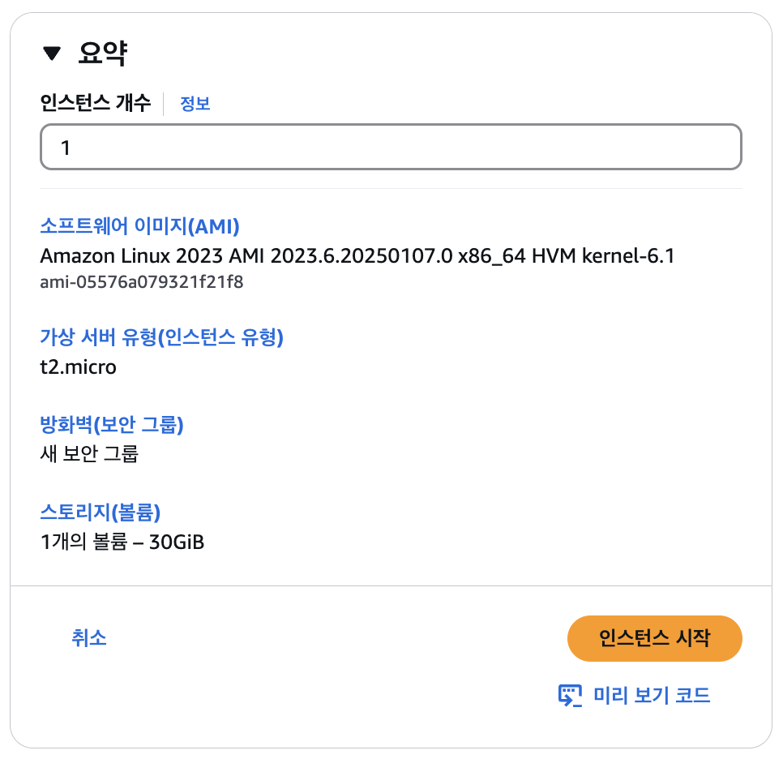

# EC2 서버 인스턴스 생성

프리 티어로 AWS EC2 사용법

> `EC2 (Elastic Compute Cloud)`란?  
> AWS의 가상 서버 서비스로, 유연한 클라우드 컴퓨팅 환경을 제공함

<br />

## EC2 인스턴스 생성 과정

### 1. EC2 인스턴스 시작

- [AWS](https://aws.amazon.com/ko)에 로그인
- AWS 콘솔에서 `EC2` 검색 → **Launch Instance** 또는 **인스턴스 시작** 클릭


인스턴스 시작을 클릭하면 인스턴스 시작 페이지로 이동하게 된다

<br />

### 2. 이름 및 태그 정보 입력

인스턴스 시작 페이지 중 **이름 및 태그** 섹션에서 인스턴스의 이름을 입력

<br />

### 3. 인스턴스 이미지 선택

**애플리케이션 및 OS 이미지(Amazon Machine Image)** 섹션에서 `Amazon Linux 2023 (AL2023) AMI`가 기본으로 설정됨

> 💡 **AL2023 주요 변경점**:
>
> - HTTPS 설정 추가
> - `amazon-linux-extras` 명령 제거
> - 새로운 패키지 매니저 **dnf** 사용

<br />

### 4. 인스턴스 유형 선택

**인스턴스 유형** 섹션에서 `t2.micro`를 선택

> 💡 **t2.micro**:
>
> - CPU 1개, RAM 1G 사양
> - 최초 1년간 매달 750시간 **무료 사용 가능**
> - 1년 또는 3년 약정인 **예약 인스턴스** 선택 시 비용 절감 가능

<br />

### 5. 키 페어 (Key Pair) 생성

**키 페어(로그인)** 섹션에서 다음을 진행:

- **새 키 페어 생성** 클릭
- 키 페어 생성 다이얼로그에서 필요한 값 입력
- 키 파일 자동 다운로드 → 안전하게 보관


> ⚠️ **Key Pair 주의사항**:
>
> - 키 파일은 한 번만 다운로드 가능하므로 안전하게 백업 필요
> - 키 파일을 분실하면 인스턴스 접근 불가

<br />

### 6. 네트워크 설정

**방화벽(보안 그룹)** 섹션에서 다음을 설정:

- 필요 시 허용 IP 지정
- **인터넷에서 HTTPS 트래픽 허용**
- **인터넷에서 HTTP 트래픽 허용**

<br />

### 7. 스토리지 추가 (Add Storage)

스토리지 크기를 **30GB**로 수정 (30GB까지 무료 제공)

<br />

### 8. 인스턴스 요약 확인 후 생성

설정을 마친 후 오른쪽 요약 섹션에서 설정 정보를 확인
확인되었다면 **인스턴스 시작** 버튼 클릭



인스턴스가 생성되면 EC2 대시보드에서 확인 가능

<br />

## 2. 인스턴스 세부 정보 확인

생성된 인스턴스의 ID를 클릭하여 세부 정보 확인
Public IP 주소를 복사하여 외부에서 접근 가능

> **172로 시작하는 IP**는 내부 IP로, 외부 접근 불가하며 동일 네트워크 내 인스턴스에서만 접근 가능

<br />

## 3. SSH 접속

1. 다운로드 받은 키 파일을 `~/keys` 폴더로 이동하고 권한 수정:

   ```bash
   mkdir ~/keys
   mv ~/Downloads/react-api-server.pem ~/keys
   chmod 400 ~/keys/react-api-server.pem
   ```

2. 아래 명령어로 SSH 접속:
   ```bash
   ssh -i ~/keys/react-api-server.pem ec2-user@<PublicIP>
   ```
