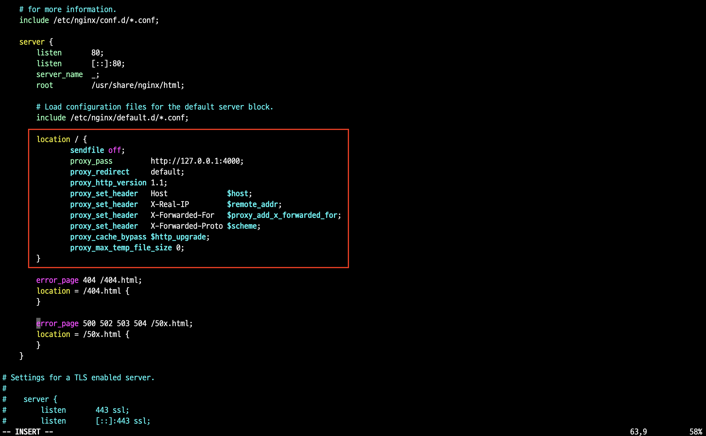

## Nginx 설치와 Node.js 연결

### 1. Nginx 설치

**Amazon Linux 2023 (AL2023) AMI**에서는 다음 명령어로 nginx를 설치

```bash
sudo yum install nginx
```

### 2. Nginx 설정 파일 수정

설치 후, nginx 설정 파일을 수정

```bash
sudo vi /etc/nginx/nginx.conf
```

아래 내용을 `location` 블록에 추가

```
location / {
    sendfile off;
    proxy_pass         http://127.0.0.1:4000;
    proxy_redirect     default;
    proxy_http_version 1.1;
    proxy_set_header   Host              $host;
    proxy_set_header   X-Real-IP         $remote_addr;
    proxy_set_header   X-Forwarded-For   $proxy_add_x_forwarded_for;
    proxy_set_header   X-Forwarded-Proto $scheme;
    proxy_cache_bypass $http_upgrade;
    proxy_max_temp_file_size 0;
}
```


<br />

### 3. 설정 테스트 및 Nginx 시작

수정을 마친 후, nginx 설정을 테스트하고 서버를 시작

```bash
sudo nginx -t

# nginx: the configuration file /etc/nginx/nginx.conf syntax is ok
# nginx: configuration file /etc/nginx/nginx.conf test is successful
```

오류가 있을 경우 메시지를 참고하여 수정하면 된다.
<br />
설정이 성공하면 nginx 서비스를 시작하고 부팅 시 자동 실행되도록 설정한다.

```bash
sudo systemctl start nginx
sudo systemctl enable nginx
curl localhost
```
